
 # Projektwoche I - SwiftUI - Rezepte App
 
 ## Feature 1: Login Screen

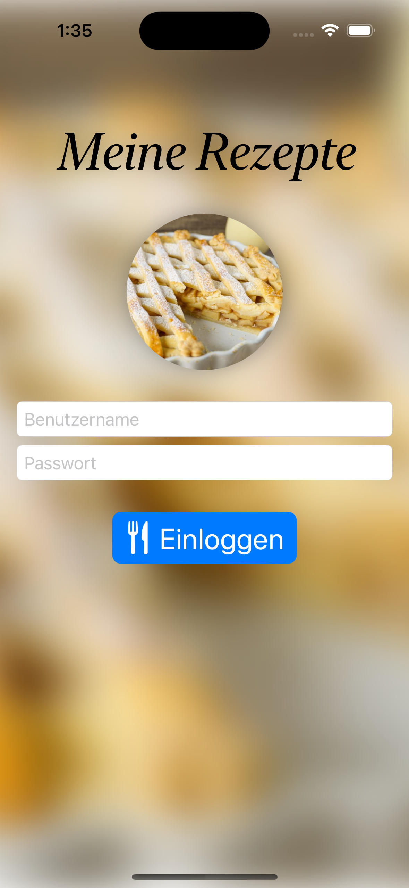

### Akzeptanzkriterien

Ich als User möchte erst in den Hauptteil der App gelangen, nachdem ich meine Zugangsdaten eingegeben habe.
1. Wenn ich den korrekten Benutzernamen und das korrekte Passwort eingegeben habe und auf "Einloggen" gedrückt habe, soll die Hauptansicht der App im Vollbild erscheinen.
2. Wenn ich den Benutzernamen leer lasse und auf "Einloggen" drücke, soll über dem Benutzername-Eingabefeld die Fehlermeldung "Es muss ein Benutzername eingegeben werden." erscheinen.
3. Wenn ich das Passwort leer lasse und auf "Einloggen" drücke, soll über dem Passwort-Eingabefeld die Fehlermeldung "Es muss ein Passwort eingegeben werden." erscheinen.
4. Wenn der Benutzername falsch ist und ich auf "Einloggen" drücke, soll über dem Benutzername-Eingabefeld die Fehlermeldung "Der Benutzername ist nicht korrekt." erscheinen.
5. Wenn das Passwort falsch ist und ich auf "Einloggen" drücke, soll über dem Passwort-Eingabefeld die Fehlermeldung "Der Benutzername ist nicht korrekt." erscheinen.

    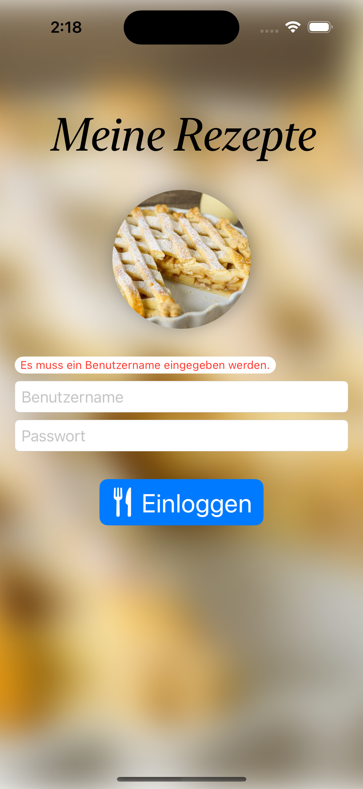
    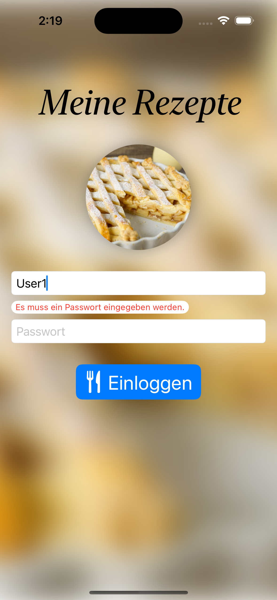
    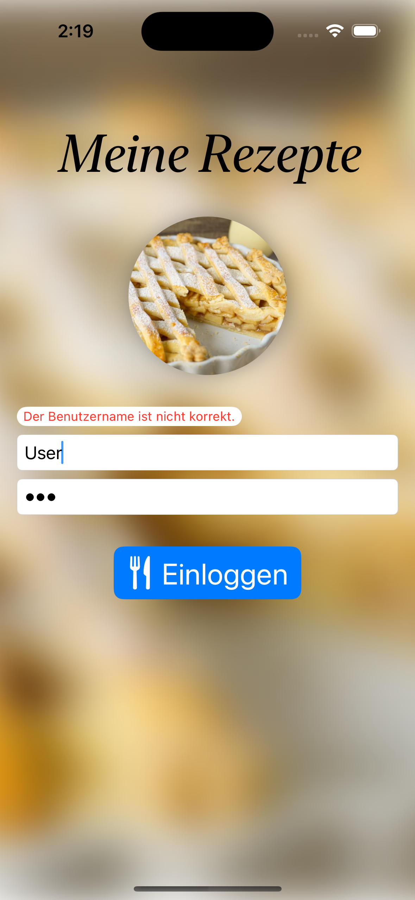
    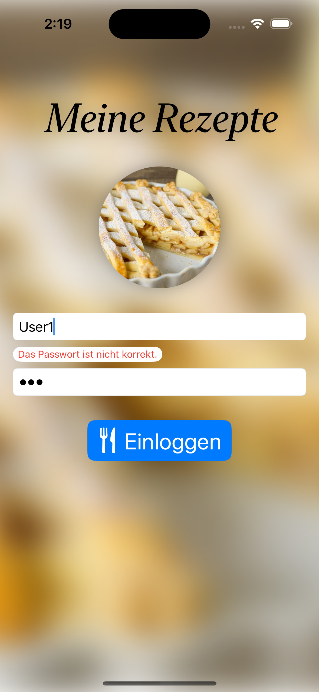

### Hinweise
- Die korrekten Zugangsdaten können mit `Content.correctUsername` und `Content.correctPassword` abgerufen werden.
- Das Bild sowohl für den Hintergrund als auch für die Mitte ist "applepie" aus dem Asset-Katalog.
- Für das Anzeigen des Hauptteils der App im Vollbild eignet sich der Modifier `fullScreenCover`.
- Der Hauptteil der App kann ersteinmal eine leere View sein, darum kümmern wir uns in den nachfolgenden Features.
- Achtet darauf, dass der `body` der View nicht zu lang und komplex ist. Hier bietet es sich an, einzelne Teile als eigene View "rauszuziehen", z.B. als `private struct` in der selben Datei. Hier würden sich der Stack mit den beiden Textfeldern oder sogar die View für die Fehlermeldung anbieten.
- Es ist sinnvoll, den Code innerhalb eines Structs mithilfe eines `// MARK: - ` Kommentares optisch weiter zu unterteilen.

## Feature 2 - Liste der Rezepte

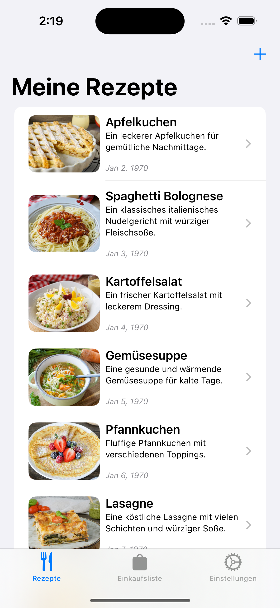

### Akzeptanzkriterien

Ich als User möchte einen Überblick über die in der App abgelegten Rezepte haben.
1. Die Liste der Rezepte soll als der erste Tab einer TabView angezeigt werden.
2. Jedes Element der Liste besteht aus einem Bild, dem Namen, der Beschreibung und dem Erstellungsdatum des Rezeptes.
3. Durch Tippen auf eines der Rezepte möchte ich zu innerhalb der TabView zu dem Rezept navigieren.
4. Durch einen Swipe nach links mochte ich das Rezept aus der Liste löschen.
5. Durch einen Swipe nach rechts möchte ich das Rezept favorisieren.
6. Ist das Rezept favorisiert, soll über dem Rezepte-Bild ein Herz-Symbol erscheinen.
7. Die anzahl der Favoriten soll als Badge über dem Icon für den ersten Tab dargestellt werden.
8. Durch einen weiteren Swipe nach links möchte ich das Rezept wieder aus den Favoriten entfernen.

    
    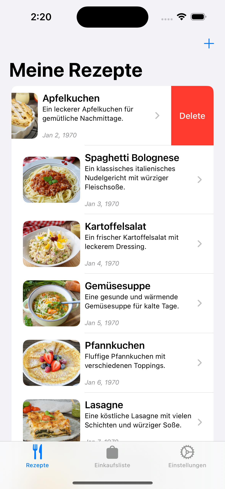
    
    
    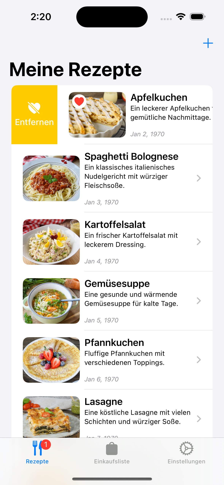

### Hinweise

- Das Array mit den Rezepten kann mit `Content.defaultRecipes` initialisiert werden.
- Alle benötigten Parameter für die Ansicht sind in dem `struct Recipe` enthalten.
- Das `struct Recipe` kann `Identifiable` gemacht werden.
- Nach Tappen auf ein Recept kann erst einmal auf eine leere View navigiert werden.
- Überlegt euch, wo der `@State` und wo das `@Binding` von dem Array mit den Rezepten sich befinden müssen, damit das Badge gesetzt werden kann.
- Versucht, so viel wie möglich von der View für ein Listenelement in eine eigene View zu packen, z.B. `RecipeListItemView` oder `RecipeListRow`.
- Als Parameter von `ForEach` innerhalb der `List` könnt ihr anstatt dem Array ein Binding zu dem Array übergeben. So habt ihr jedes einzelne Rezept auch als Binding da und könnt es in die `RecipeListRow` übergeben.

## Feature 3 - Rezept Detailansicht

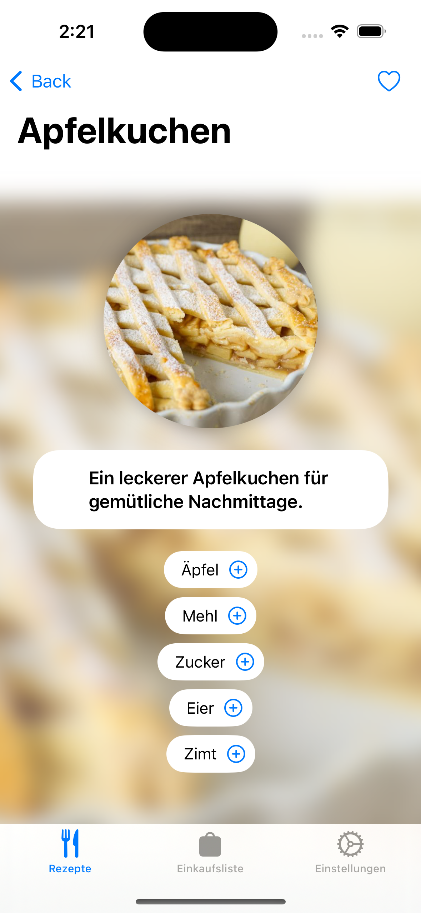

### Akzeptanzkriterien

Ich als User möchte Details zu einem Rezept betrachten können.
1. Durch Tippen auf eines der Rezepte in der Rezepte-Liste möchte ich zu innerhalb der TabView zu dem Rezept navigieren.
2. Die gesamte Ansicht soll scrollbar sein, sodass auch mehr als 5 Zutaten aufgelistet werden können.
3. Wenn ich oben rechts auf das Herz-Symbol drücke, wird das Rezept favorisiert.
4. Ist das Rezept favorisiert, dann ist das Herz-Symbol gefüllt, sonst ist es leer.
5. Auch hier soll der Badge am ersten Tab-Symbol sich ändern, wenn das Rezept favorisiert wird.
6. Wenn ich auf das Plus-Symbol rechts von einer Zutat drücke, wird es der Einkaufsliste hinzugefügt.
7. Wenn eine Zutat in der Einkaufsliste ist, dann verwandelt sich das Plus-Symbol in ein gefülltes Minus-Symbol.
7. Das Badge am zweiten Tab-Symbol zeigt an, wieviele Zutaten in der Einkaufsliste sind.

    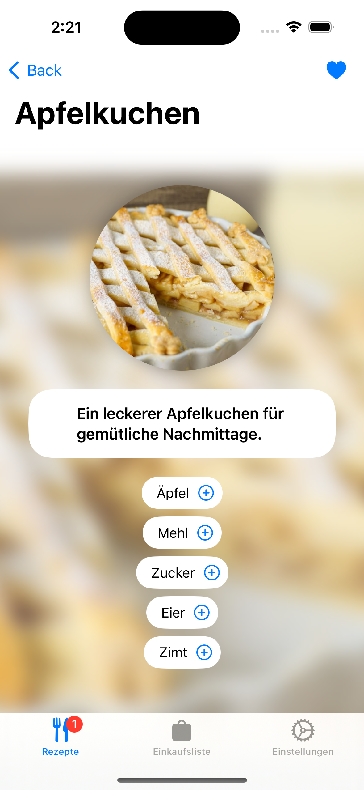
    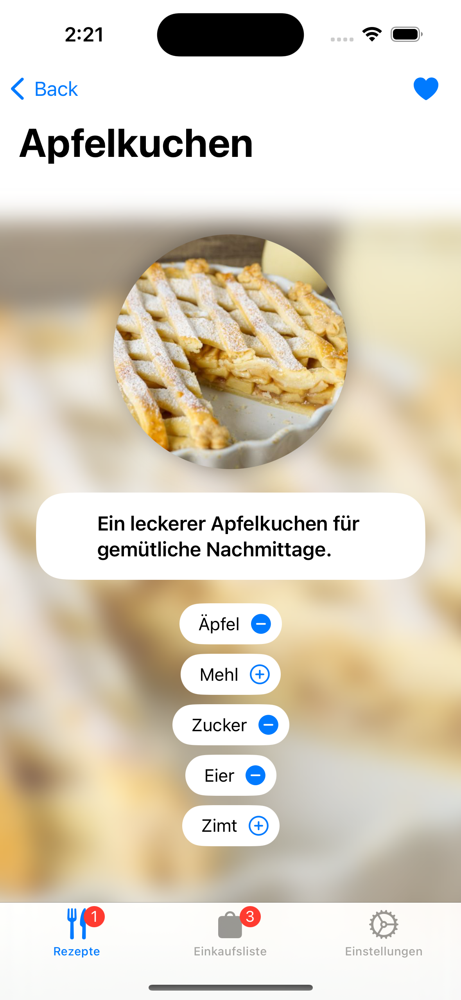

### Hinweise

- Die Einkaufsliste kann einfach ein Array von Strings sein.
- Die View für den zweiten Tab müsst ihr noch nicht befüllen.
- Auch hier ist es wichtig, wo der State und wo die Bindings von dem Einkaufslisten-Array liegen.

## Feature 4 - Neues Rezept erstellen

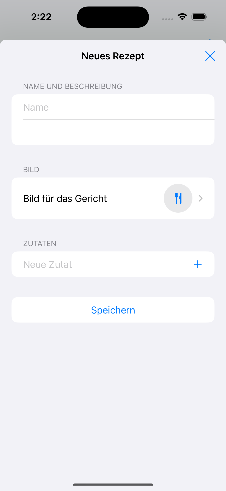

### Akzeptanzkriterien

Ich als User möchte die Möglichkeit haben, selbst ein neues Rezept zu erstellen und es der Liste hinzuzufügen.
1. Wenn ich in der Rezepte-Liste auf den Plus-Button drücke, erscheint die Ansicht zum Hinzufügen eines neuen Rezeptes in einem Sheet.
2. Oben kann ich den Titel und eine Beschreibung angeben.
3. Weiter unten kann ich ein Bild für das Rezept auswählen. Die auswählbaren Bilder erscheinen in einem neuen Screen innerhalb des Sheets.
4. Weiter unten kann ich eine Zutat in ein Textfeld eintragen und durch Drücken auf den Plus-Button neben dem Textfeld die Zutat hinzufügen. Diese erscheint dann in der Liste unter dem Textfeld.
5. Wenn ich auf "Speichern" drücke, wird das Rezept der Rezepte-Liste hinzugefügt und das Sheet geschlossen.
6. Wenn ich auf "Speichern" drücke und kein Name für das Rezept angegeben wurde, erscheint über dem Textfeld eine Fehlermeldung "Bitte Namen eingeben".
7. Wenn ich auf den Schließen-Button oben rechts drücke oder das Sheet runterziehe, wird das Rezept verworfen.

    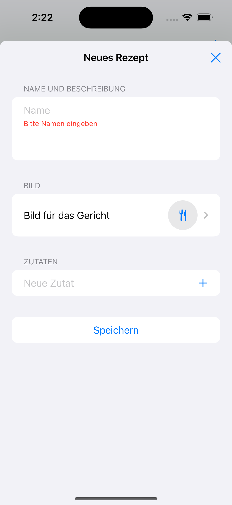
    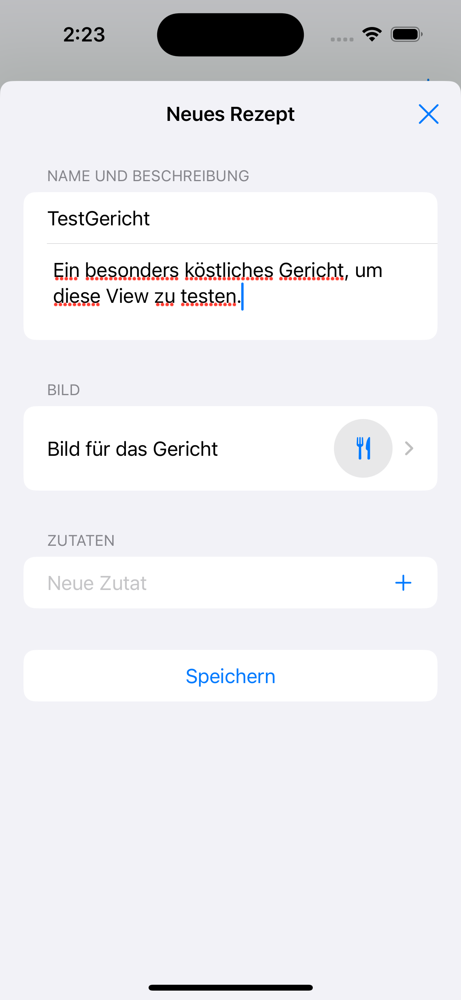
    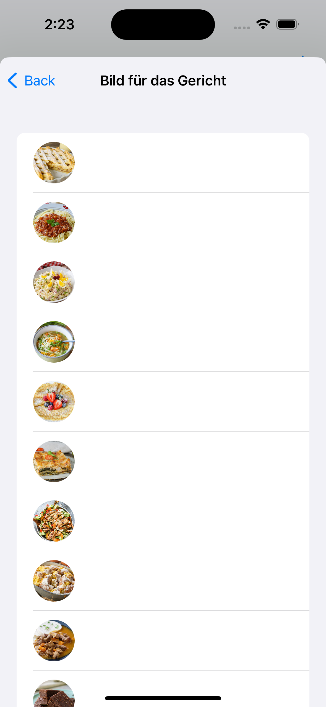
    
    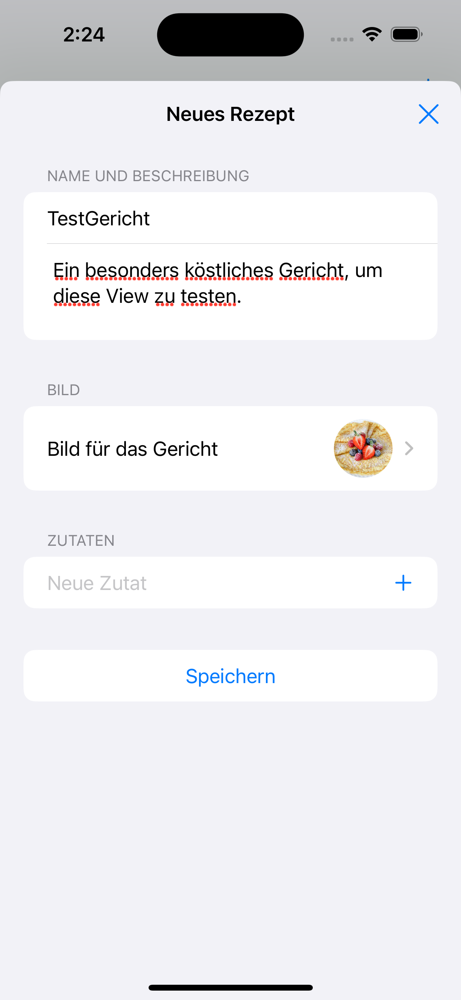
    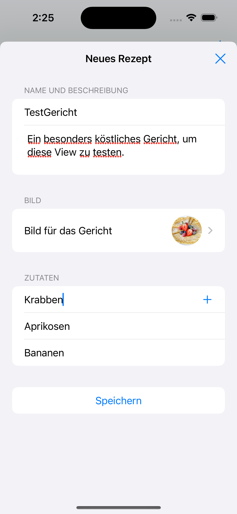
    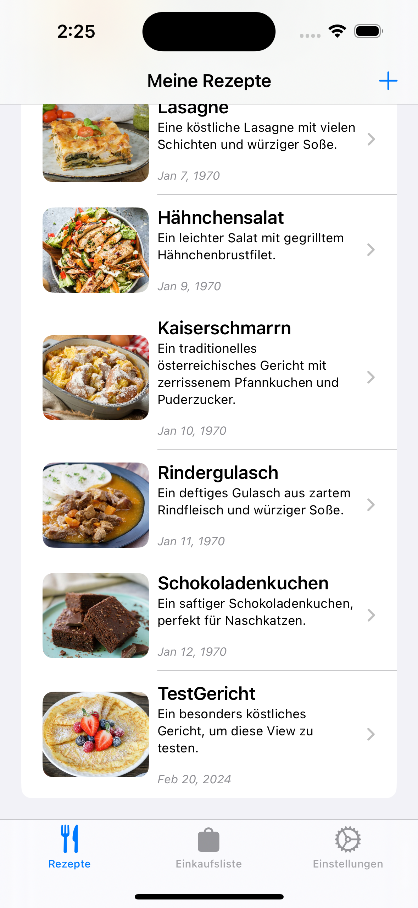

### Hinweise

- Für die Bilder-Auswahl würde sich am besten der `.pickerStyle(.navigationLink)` am besten eignen.
- Überlegt, was ihr in diese neue View übergeben müsst, damit ihr direkt dort ein neues Rezept zu der Liste hinzufügen könnt.

## Feature 5 - Zutaten-Liste und Einstellungen

    
    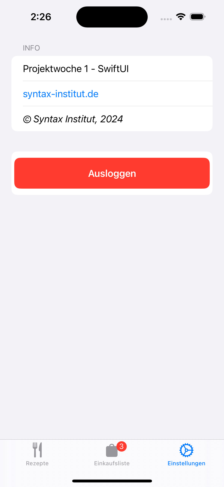

### Akzeptanzkriterien

Ich als User möchte die zu der Einkauftsliste hinzugefügten Zutaten sehen können. Außerdem brauche ich ein Einstellungsmenü.
1. Gehe ich auf den zweiten Tab, sehe ich eine Auflistung der zu der Einkaufsliste hinzugefügten Zutaten.
2. Wenn keine Zutaten hinzugefügt wurden, soll anstatt der Liste die Aussage zu sehen sein, dass die Liste noch leer ist.
3. Durch einen Swipe nach links kann ich die Zutaten löschen. Die neue Anzahl der Zutaten spiegelt sich in dem Badge automatisch wieder.
4. Durch einen Tap auf den "Pfeil nach unten" Button oben rechts werden die Zutaten alphabetisch sortiert.
5. Gehe ich auf den dritten Tab, sehe ich das Einstellungs- bzw. Info-Menu.
6. Oben sehe ich Infos zu der App aufgelistet: allgemeine Info, einen Link, über den ich auf die Webseite komme und eine Copyright-Angabe.
7. Unten befindet sich ein Logout-Button. Nach dem Tap auf diesen Button gelange ich wieder auf den Login-Screen.

    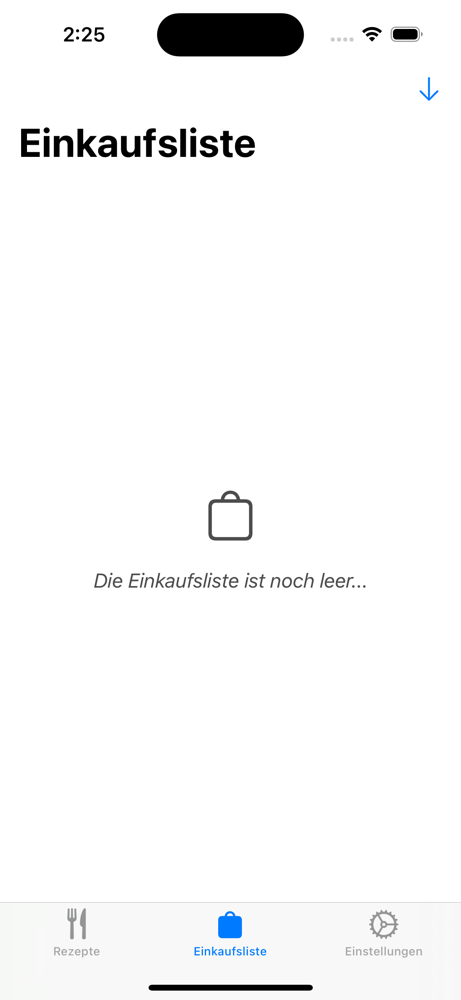
    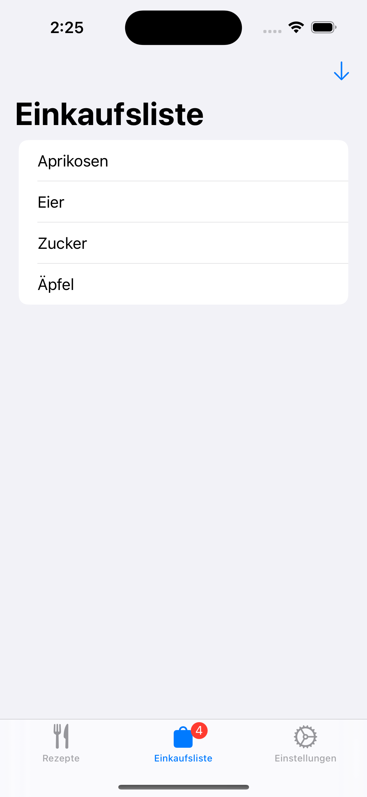
    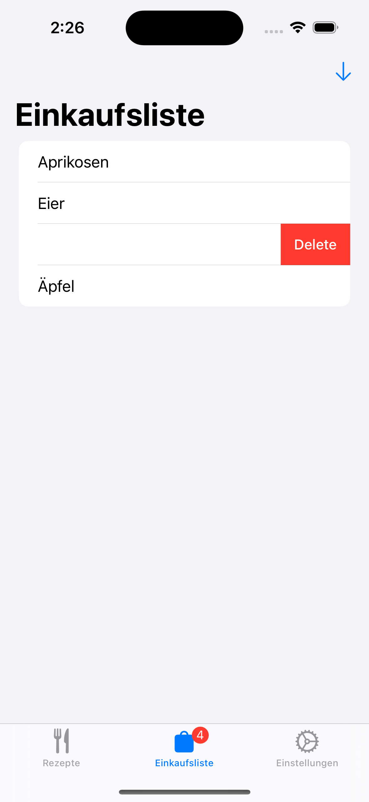

### Hinweise zum Logout

- Erinnert euch bzw. kuckt nach, wie ihr die Haupt-App-Ansicht vom Login-Screen aus präsentiert habt. Mithilfe desselben Variablen könnt ihr diess rückgängig machen, also "Ausloggen".